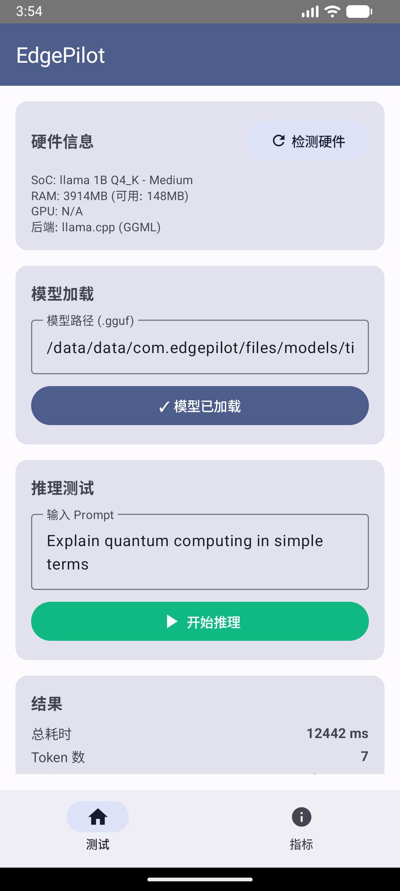
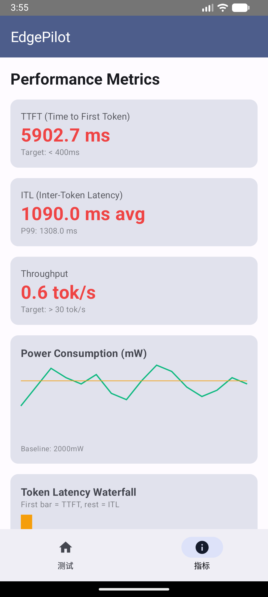

# EdgePilot

**移动端 LLM 推理性能优化框架** — 在 Android 设备上本地运行大语言模型，实时监控推理性能指标。

> 项目面向移动端 AI 推理优化场景，集成 llama.cpp 作为底层推理引擎，提供硬件检测、模型加载、文本生成、性能指标采集等完整链路。

## 应用截图

| 测试 Tab | 指标 Tab |
|:---:|:---:|
|  |  |
| 硬件检测 · 模型加载 · Prompt 推理 | TTFT · ITL · 吞吐量 · 功耗曲线 |

## 核心功能

- **硬件检测** — 识别 SoC、RAM、GPU 信息，自动推荐推理配置
- **模型加载** — 支持 GGUF 格式模型（TinyLlama 等），自动适配量化方案
- **文本生成** — 基于 llama.cpp 的同步/异步推理，支持流式输出
- **性能指标** — 实时采集 TTFT、ITL、吞吐量等关键指标
- **KV Cache 管理** — 支持导出、导入、压缩 KV Cache

## 技术架构

```
┌─────────────────────────────────────────────────┐
│                   Android App                    │
│  ┌───────────┐  ┌──────────────┐  ┌───────────┐ │
│  │  Compose   │  │  ViewModel   │  │ JNI Bridge│ │
│  │    UI      │──│  (Kotlin)    │──│ (C++ JNI) │ │
│  └───────────┘  └──────────────┘  └─────┬─────┘ │
├──────────────────────────────────────────────────┤
│                  C++ Core Engine                  │
│  ┌──────────────┐  ┌───────────────────────────┐ │
│  │ Backend       │  │    llama.cpp (GGML)       │ │
│  │ Factory       │──│  模型加载 · Tokenize      │ │
│  │               │  │  Prefill · Decode · Sample│ │
│  └──────────────┘  └───────────────────────────┘ │
├──────────────────────────────────────────────────┤
│  Hardware Detection · KV Cache · Metrics         │
└─────────────────────────────────────────────────┘
```

## 技术栈

| 层级 | 技术 |
|---|---|
| UI | Jetpack Compose + Material 3 |
| 状态管理 | ViewModel + StateFlow |
| 原生桥接 | JNI (C++ ↔ Kotlin) |
| 推理引擎 | llama.cpp (静态链接) |
| 构建 | CMake + Gradle (NDK) |
| 目标架构 | arm64-v8a |

## 项目结构

```
EdgePilot/
├── android/                          # Android 应用
│   ├── app/src/main/java/com/edgepilot/
│   │   ├── MainActivity.kt           # 主 Activity
│   │   ├── native/NativeEngine.kt    # JNI 桥接层
│   │   ├── viewmodel/                # ViewModel
│   │   └── ui/screens/               # Compose 页面
│   └── build.gradle.kts
├── core/                             # C++ 核心引擎
│   ├── include/edgepilot/
│   │   ├── backend/
│   │   │   ├── inference_backend.h   # 推理后端接口
│   │   │   ├── ggml_backend.h        # llama.cpp 实现
│   │   │   └── backend_factory.h     # 后端工厂
│   │   └── common/types.h            # 公共类型定义
│   ├── src/
│   │   ├── backend/ggml_backend.cpp  # llama.cpp 推理实现
│   │   ├── backend/backend_factory.cpp
│   │   └── jni/edgepilot_jni.cpp     # JNI 入口
│   ├── third_party/llama.cpp/        # llama.cpp 子模块
│   └── CMakeLists.txt
└── models/                           # 测试模型
    └── tinyllama-1.1b-chat-v1.0.Q4_K_M.gguf
```

## 构建与运行

### 环境要求

- Android Studio (带 NDK)
- JDK 17+
- Android SDK 34+

### 步骤

1. **克隆仓库**
   ```bash
   git clone https://github.com/<your-username>/EdgePilot.git
   cd EdgePilot
   ```

2. **初始化 llama.cpp 子模块**
   ```bash
   git submodule update --init --recursive
   ```

3. **打开 Android Studio**，加载 `android/` 目录

4. **准备模型文件**
   ```bash
   # 推送模型到设备（模拟器）
   adb push models/tinyllama-1.1b-chat-v1.0.Q4_K_M.gguf /data/local/tmp/tinyllama.gguf
   adb shell run-as com.edgepilot sh -c 'mkdir -p files/models && cat /data/local/tmp/tinyllama.gguf > files/models/tinyllama.gguf'
   ```

5. **运行应用**，在 Android Studio 点击 Run

### 使用流程

1. 点击 **检测硬件** — 查看设备信息
2. 输入模型路径，点击 **加载模型**
3. 输入 Prompt，点击 **开始推理**
4. 切换到 **指标 Tab** 查看性能数据

## 性能说明

| 环境 | 吞吐量 | 说明 |
|---|---|---|
| x86 模拟器 | ~0.7 tok/s | ARM→x86 转译，仅用于功能验证 |
| 物理设备 (ARM64) | 预计 5-15 tok/s | 取决于 SoC 和内存带宽 |

> 当前测试基于 TinyLlama 1.1B Q4_K_M 量化模型，在模拟器上主要验证推理链路完整性。

## 版本迭代规划

见 [ROADMAP.md](ROADMAP.md) — 从数据可信、真机基线到 KV Cache 优化与推测解码的完整路线图。

## 核心指标说明

- **TTFT (Time to First Token)** — 从发送请求到首个 token 生成的延迟
- **ITL (Inter-Token Latency)** — 相邻 token 之间的生成间隔
- **Throughput** — 每秒生成的 token 数量 (tok/s)

## License

[GNU Affero General Public License v3.0](LICENSE)
