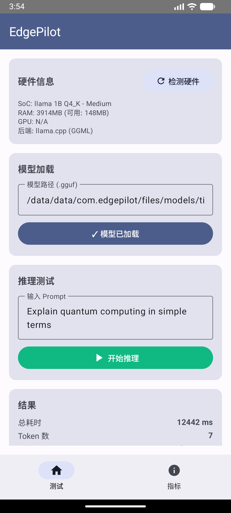
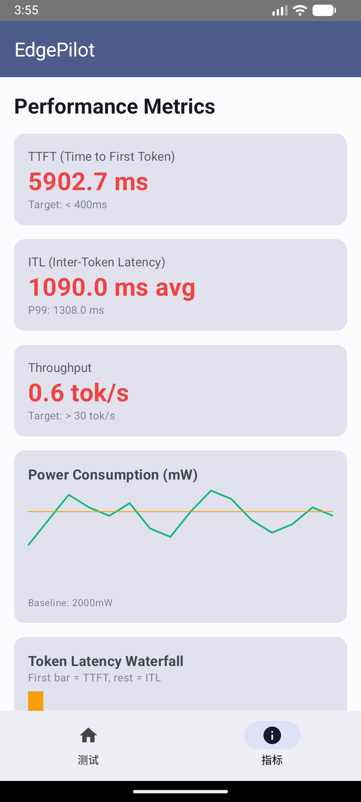

# EdgePilot

**移动端 LLM 推理性能优化框架** — 在 Android 设备上本地运行大语言模型，实时监控推理性能指标。

> 项目面向移动端 AI 推理优化场景，集成 llama.cpp 作为底层推理引擎，提供硬件检测、模型加载、文本生成、性能指标采集等完整链路。

## 应用截图

| 测试 Tab | 指标 Tab |
|:---:|:---:|
|  |  |
| 硬件检测 · 模型加载 · Prompt 推理 | TTFT · ITL · 吞吐量 · 功耗曲线 |

## 核心功能

- **硬件检测** — 识别 SoC、RAM、GPU 信息，自动推荐推理配置
- **模型加载** — 支持 GGUF 格式模型（TinyLlama 等），自动适配量化方案
- **文本生成** — 流式逐 token 输出（打字机），支持中途停止；同步 API 供基准测试使用
- **性能指标** — 逐 token 采集 TTFT、ITL（Avg/P50/P90/P99）、吞吐量，全部来自真实推理
- 真机基线矩阵 — 线程数 × 短/中/长 prompt 一键跑完，功耗(tokens/Joule)/温度节流/内存分解逐 cell 导出 CSV+JSON
- sysfs 资源采集 — 电流×电压积分、thermal_zone 温度、Pss/VmRSS 内存，能力自检矩阵驱动 UI 徽标，不可用通道诚实留空
- **多轮会话演示** — 测试 Tab「多轮」开关：开=KV 跨轮复用（首轮必全新、续写只填新内容），逐轮 TTFT 卡片；拨动开关即终结演示会话（与引擎 KV 自洽）
- **会话矩阵 harness** — 基线 Tab cache on/off × 短/中/长桶 × 3 轮 = 18 单元，导出 `session.csv`（V1 降幅口径）
- **KV 量化三档对比** — F16 / K8V8 / K8V4（K 保守 Q8_0）同长贪心对比，逐档重建 ctx，导出 `quant.csv` + 贪心 token 文本（V2 字节口径 / V5 一致率源）
- **跨进程会话恢复** — adb intent 触发 save/load，五段校验链（模型指纹/尺寸不符如实 REJECTED），结果留档 `recovery/` 目录
- **推荐配置卡片** — 已加载=引擎实态 + KV 预算校验（可用内存×0.55）；未加载=预测 + 如实 note；一键应用 threads/kv 到下次加载
- **KV Cache 管理** — 支持导出、导入、压缩 KV Cache

> **v0.4 行为变化**：低端设备 n_ctx 受 KV 预算自动降档（4096→2048→1024→512 逐档取首个可容纳者；全超则封顶 512 并在推荐卡片警示"当前 KV 超出内存预算"）。

## 技术架构

```
┌─────────────────────────────────────────────────┐
│                   Android App                    │
│  ┌───────────┐  ┌──────────────┐  ┌───────────┐ │
│  │  Compose   │  │  ViewModel   │  │ JNI Bridge│ │
│  │    UI      │──│  (Kotlin)    │──│ (C++ JNI) │ │
│  └───────────┘  └──────────────┘  └─────┬─────┘ │
├──────────────────────────────────────────────────┤
│                  C++ Core Engine                  │
│  ┌──────────────┐  ┌───────────────────────────┐ │
│  │ Backend       │  │    llama.cpp (GGML)       │ │
│  │ Factory       │──│  模型加载 · Tokenize      │ │
│  │               │  │  Prefill · Decode · Sample│ │
│  └──────────────┘  └───────────────────────────┘ │
├──────────────────────────────────────────────────┤
│  Hardware Detection · KV Cache · Metrics         │
└─────────────────────────────────────────────────┘
```

## 技术栈

| 层级 | 技术 |
|---|---|
| UI | Jetpack Compose + Material 3 |
| 调试日志 | 编译期宏 `EP_LOGGING`（默认裁剪，`-PepLogging=true` 开启） |
| 资源采集 | `/sys/class/power_supply`(电流×电压) · `thermal_zone*` · `/proc/self/smaps_rollup` — 免权限纯 sysfs，10Hz 采样 |
| 状态管理 | ViewModel + StateFlow |
| 原生桥接 | JNI (C++ ↔ Kotlin) |
| 推理引擎 | llama.cpp (静态链接) |
| 构建 | CMake + Gradle (NDK) |
| 目标架构 | arm64-v8a |

## 项目结构

```
EdgePilot/
├── android/                          # Android 应用
│   ├── app/src/main/java/com/edgepilot/
│   │   ├── MainActivity.kt           # 主 Activity
│   │   ├── native/NativeEngine.kt    # JNI 桥接层
│   │   ├── viewmodel/                # ViewModel
│   │   └── ui/screens/               # Compose 页面
│   └── build.gradle.kts
├── core/                             # C++ 核心引擎
│   ├── include/edgepilot/
│   │   ├── backend/
│   │   │   ├── inference_backend.h   # 推理后端接口
│   │   │   ├── ggml_backend.h        # llama.cpp 实现
│   │   │   └── backend_factory.h     # 后端工厂
│   │   └── common/types.h            # 公共类型定义
│   ├── src/
│   │   ├── backend/ggml_backend.cpp  # llama.cpp 推理实现
│   │   ├── backend/backend_factory.cpp
│   │   └── jni/edgepilot_jni.cpp     # JNI 入口
│   ├── third_party/llama.cpp/        # llama.cpp 子模块
│   └── CMakeLists.txt
└── models/                           # 测试模型
    └── tinyllama-1.1b-chat-v1.0.Q4_K_M.gguf
```

## 构建与运行

### 环境要求

- Android Studio (带 NDK)
- JDK 17+
- Android SDK 34+

### 步骤

1. **克隆仓库**
   ```bash
   git clone https://github.com/<your-username>/EdgePilot.git
   cd EdgePilot
   ```

2. **初始化 llama.cpp 子模块**
   ```bash
   git submodule update --init --recursive
   ```

3. **打开 Android Studio**，加载 `android/` 目录

4. **准备模型文件**
   ```bash
   # 推送模型到设备（模拟器）
   adb push models/tinyllama-1.1b-chat-v1.0.Q4_K_M.gguf /data/local/tmp/tinyllama.gguf
   adb shell run-as com.edgepilot sh -c 'mkdir -p files/models && cat /data/local/tmp/tinyllama.gguf > files/models/tinyllama.gguf'
   ```

5. **运行应用**，在 Android Studio 点击 Run

### 使用流程

1. 点击 **检测硬件** — 查看设备信息
2. 输入模型路径，点击 **加载模型**
3. 输入 Prompt，点击 **开始推理**
4. 切换到 **指标 Tab** 查看性能数据
5. 基线 Tab：确认能力徽标 → 选线程集 → 跑完整矩阵 → 按界面提示 `adb pull` 导出目录取 CSV/JSON
6. 会话矩阵/量化对比：基线 Tab 第二/三按钮（与矩阵互斥串行跑）；Mock 环境不模拟会话，全部单元如实记 ERROR
7. adb 恢复通道（跨进程会话热恢复，需真机、通道串行执行——跑通道时不要在 UI 并发推理）：
   ```bash
   # 导出：t1→t2→存档→贪心探针（探针不入档）
   adb shell am start -n com.edgepilot/.MainActivity --es ep_session_save rec1
   adb shell cat /sdcard/Android/data/com.edgepilot/files/recovery/session_export_result.txt   # 须 EXPORTED
   # 冷恢复：force-stop 杀掉进程后按名载入（intent 参数=存档名，非路径；存档两文件在外部 files/recovery/ 目录，与结果文件同级 adb 可见）
   adb shell am force-stop com.edgepilot
   adb shell am start -n com.edgepilot/.MainActivity --es ep_session_load rec1
   adb shell cat /sdcard/Android/data/com.edgepilot/files/recovery/session_recover_result.txt  # 须 PASS（贪心逐字对）
   # 拒绝路径示例：adb pull /sdcard/Android/data/com.edgepilot/files/recovery/rec1.kvdat.json
   # 改 model_path（或 model_size）后 adb push 回同路径 → force-stop → 再 load → REJECTED
   ```
   模型路径三处同改（默认同一文件）：`Recovery.kt:14` / `HomeScreen.kt:33` / `BaselineScreen.kt:34`。

### 会话/量化 CSV 字段速览

`session.csv`（17 列）：`run_ts,device,android_soc,threads,bucket,turn,cache_mode,submitted_chars,max_tokens,total_tokens,ttft_ms,itl_p99_ms,tokens_per_sec,energy_J,pss_peak_mb,cache_hit,status` — `cache_hit` 为声明式复用标记（on 模式 R2/R3=1）；NaN 通道列输出为空（不伪造）。

`quant.csv`（16 列）：`run_ts,device,android_soc,kv_bits,threads,n_ctx,prefill_target_chars,total_tokens,ttft_ms,used_bytes,total_bytes,energy_J,pss_peak_mb,retried,status,note` — `threads` 恒 `0`（=推荐档）；`prefill_target_chars` 实为 `len/4` 目标 token 近似；`n_ctx<4096`（预算降档）时长文走半量重试，`retried=1`/`note=半量重试(3×LONG)`（重试后再失败行 `retried=0`，错误文本占 note）；quant 目录无 meta.json——出处即 CSV 每行（spec §5.2 工件集合）。

## 性能说明

| 环境 | 吞吐量 | 说明 |
|---|---|---|
| x86 模拟器 | ~0.7 tok/s | ARM→x86 转译，仅用于功能验证 |
| 物理设备 (ARM64) | 预计 5-15 tok/s | 取决于 SoC 和内存带宽 |

> 当前测试基于 TinyLlama 1.1B Q4_K_M 量化模型，在模拟器上主要验证推理链路完整性。

## 版本迭代规划

见 [ROADMAP.md](ROADMAP.md) — 从数据可信、真机基线到 KV Cache 优化与推测解码的完整路线图。

## 核心指标说明

- **TTFT (Time to First Token)** — 从发送请求到首个 token 生成的延迟
- **ITL (Inter-Token Latency)** — 相邻 token 之间的生成间隔
- **Throughput** — 每秒生成的 token 数量 (tok/s)
- **ITL 分位数** — P50/P90/P99 由 native 层对相邻 token 时间戳差值直接计算（nearest-rank），非均值估算

## License

[GNU Affero General Public License v3.0](LICENSE)
